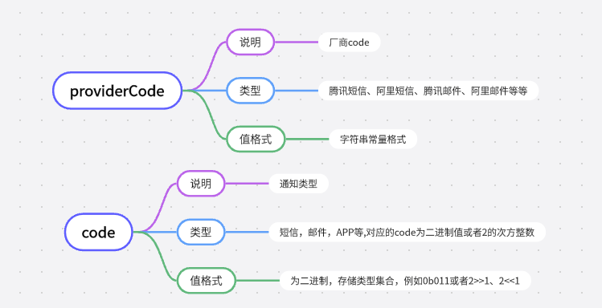
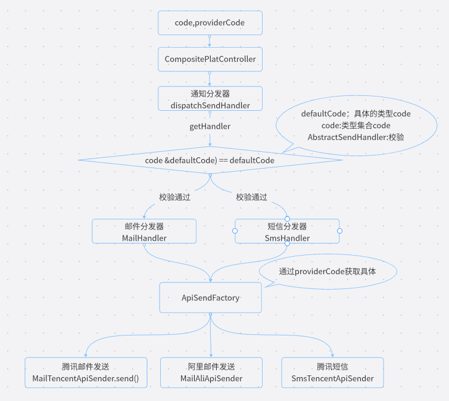

<p align="center">
 
 
</p>

# luntron-design-pattern
Java设计模式的运用
## luntron-design-pattern-apply
### 1、使用二进制计算方式减少短信开关数据表的设计
```
/**
 * @description 发送类型.
 * 这里使用二进制的目的是减少数据库短信开关数据表，只需要维护一个userHandlerCode字段即可，减少查库，同时基于计算机底层二进制计算处理速度更快了
 * 开关默认值serHandlerCode=ob1000。添加邮件开关 serHandlerCode | 0b001 【或运算】 删除邮件开关serHandlerCode ^ ob001【亦或运算】
 * 判断开关是否成立 userHandlerCode & code = code  code为某个开关的二进制值或者2的n次方
 * @author luntron
 * @var userHandlerCode 用户的消息推送开关值,初始值为0
 * @var code            当前枚举的code值,code值为2的n次方倍
 * @var 0b              表示数的格式为二进制格式
 * @var 0b001           表示2的0次方 = 1
 * @date 2022/1/2 2:58
 */
public enum SendHandler {
//0b001 = 2>>1  ，右移计算(除以二)
mail(2 >> 1, "mailHandler", "邮件-ob001"),
//0b010 = 2
sms(2, "smsHandler", "短信-ob010"),
/**
* 2 << 1，左移计算(乘以2，2*2)  假如是2 << 4 ，2*2*2*2*2
*/
app(2 << 1, "appHandler", "ob100"),

    other(2 << 10, "otherHandler", "other"),
    ;
    private Integer code;
    private String beanName;
    private String name;

    public Integer getCode() {
        return code;
    }

    public String getBeanName() {
        return beanName;
    }

    public String getName() {
        return name;
    }

    SendHandler(Integer code, String beanName, String name) {
        this.code = code;
        this.beanName = beanName;
        this.name = name;
    }
}

```

### 2、使用策略+模板方法+工厂方式构建通知路由



### 3、使用spring.factories构建启动前置项
创建src/main/resources/META-INF/spring.factories 文件

spring.factories

```

org.springframework.context.ApplicationContextInitializer=com.luntron.app.initializer.DemoApplicationContextInitializer
org.springframework.boot.BootstrapRegistryInitializer=com.luntron.app.initializer.DemoBootStrapRegistryInitializer

```
ApplicationContextInitializer

```
public class DemoApplicationContextInitializer implements ApplicationContextInitializer, Ordered {
@Override
public void initialize(ConfigurableApplicationContext applicationContext) {
System.out.println(">>>>>>>>>>>自定义DemoApplicationContextInitializer");
}

    @Override
    public int getOrder() {
        return 0;
    }
}

```
BootstrapRegistryInitializer

```
public class DemoBootStrapRegistryInitializer implements BootstrapRegistryInitializer, Ordered {

    @Override
    public int getOrder() {
        return 0;
    }

    @Override
    public void initialize(BootstrapRegistry registry) {
        System.out.println(">>>>>>>>>>>>>>自定义DemoBootStrapRegistryInitializer");
    }
}

```